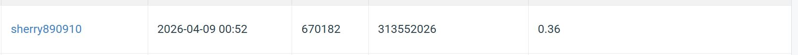

# NYCU Visual Recognition 2026 Spring — HW2: Digit Detection with DETR

**Student ID:** 313552026  
**Leaderboard Score:** 0.36 (mAP@[0.5:0.95])

---

## Introduction

This project implements digit detection using **DETR (DEtection TRansformer)** with a **ResNet-50** backbone on the NYCU HW2 dataset. The dataset consists of street-view images containing digit sequences (0–9), provided in COCO format with category IDs 1–10.

Key contributions beyond the baseline:
- **Critical bug fix**: `category_id=10` (digit "9") was silently mapped to DETR's no-object class index, causing it to never be detected. Fixed by using 0-indexed `id2label` keys.
- **Per-class NMS**: Replaced class-agnostic NMS with per-class NMS to avoid suppressing different digit classes that overlap spatially.
- **Multi-scale TTA**: Test-time augmentation with scales ×0.8, ×1.0, ×1.2 to improve recall on small and large digits.
- **Data augmentation**: Diverse color jitter, Gaussian noise/blur, scale jitter (0.75–1.25×), and affine transforms.
- **Train+Val merge**: Combined training and validation sets (33,402 images total) to maximize training data.

---

## Environment Setup

### Requirements
- Python 3.10
- PyTorch 2.9+ with CUDA 12
- Conda environment

### Create Environment

```bash
conda create -n Visual_Recognition python=3.10
conda activate Visual_Recognition
pip install torch torchvision --index-url https://download.pytorch.org/whl/cu128
pip install transformers>=4.35.0 albumentations>=1.3.0 pycocotools timm opencv-python tqdm
```

### Data Preparation

Place the dataset under:
```
visual_recognition_hw2/data/nycu-hw2-data/
├── train/          # 30,062 training images
├── valid/          # 3,340 validation images
├── test/           # 13,068 test images
├── train.json      # COCO-format annotations
└── valid.json
```

---

## Usage

### Training (SLURM)

```bash
# Submit full training job (100 epochs, ~20h on H200)
sbatch slurm_train_hw2.sh
```

To switch to a quick smoke test (~10 min), edit `slurm_train_hw2.sh`:
```bash
MODE="smoke"   # change from "full" to "smoke"
```

### Training (Local)

```bash
python train_hw2_detr.py \
    --data_root data/nycu-hw2-data \
    --output_dir runs/exp1 \
    --epochs 100 \
    --batch_size 4 \
    --grad_accum_steps 2 \
    --lr 1e-4 \
    --lr_backbone 1e-5 \
    --combine_trainval \
    --conf_threshold 0.3 \
    --nms_iou 0.5 \
    --max_dets_per_image 30 \
    --amp \
    --do_train
```

### Inference (generate pred.json)

```bash
python train_hw2_detr.py \
    --data_root data/nycu-hw2-data \
    --output_dir runs/exp1 \
    --checkpoint runs/exp1/checkpoints/best.pt \
    --conf_threshold 0.05 \
    --nms_iou 0.5 \
    --max_dets_per_image 30 \
    --tta --tta_scales 0.8,1.0,1.2 \
    --do_infer
```

### Validate pred.json format

```bash
python train_hw2_detr.py --validate_pred runs/exp1/pred.json
```

---

## Performance Snapshot



| Split | mAP@[0.5:0.95] | mAP@0.5 |
|---|---|---|
| Validation (epoch 100) | 0.5375 | 0.9538 |
| **Leaderboard (test)** | **0.36** | — |

> Note: The validation mAP is inflated because training used `--combine_trainval` (validation images were included in the training set). The honest leaderboard score is 0.36.

---

## Project Structure

```
visual_recognition_hw2/
├── train_hw2_detr.py       # Main training + inference script
├── slurm_train_hw2.sh      # SLURM job submission script
├── data/nycu-hw2-data/     # Dataset (not tracked in git)
├── outputs/                # Training runs, checkpoints, pred.json
└── README.md
```

---

## References

- Carion et al., *End-to-End Object Detection with Transformers (DETR)*, ECCV 2020. [[paper]](https://arxiv.org/abs/2005.12872)
- HuggingFace Transformers: `facebook/detr-resnet-50` [[model card]](https://huggingface.co/facebook/detr-resnet-50)
- Buslaev et al., *Albumentations: Fast and Flexible Image Augmentations*, Information 2020. [[paper]](https://www.mdpi.com/2078-2489/11/2/125)
